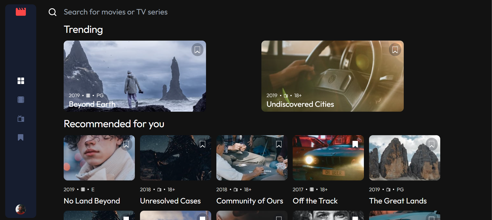

# Frontend Mentor - Entertainment web app solution

This is a solution to the [Entertainment web app challenge on Frontend Mentor](https://www.frontendmentor.io/challenges/entertainment-web-app-J-UhgAW1X). Frontend Mentor challenges help you improve your coding skills by building realistic project.

## Table of contents

- [Overview](#overview)
  - [The challenge](#the-challenge)
  - [Screenshot](#screenshot)
  - [Links](#links)
  - [Built with](#built-with)
  - [What I learned](#what-i-learned)
- [Author](#author)

## Overview

### The challenge

Users should be able to:

- View the optimal layout for the app depending on their device's screen size
- See hover states for all interactive elements on the page
- Navigate between Home, Movies, TV Series, and Bookmarked Shows pages
- Add/Remove bookmarks from all movies and TV series
- Search for relevant shows on all pages
- **Bonus**: Build this project as a full-stack application
- **Bonus**: If you're building a full-stack app, we provide authentication screen (sign-up/login) designs if you'd like to create an auth flow

### Screenshot

### Links

- Solution URL: [www.frontendmentor.io](https://www.frontendmentor.io/solutions/nuxtjs-typescript-directus-tailwind-api-sLiw22Va40)
- Live Site URL: [www.entertainment-web-app.com](https://entertainment-web-app-lovat-nine.vercel.app/)

### Built with

- NuxtJs
- TypeScript
- Directus
- Tailwind
- Mobile-first workflow

### What I learned

Building this project has been a tremendous learning experience. Here are some of the key takeaways:

1. **Nuxt.js**: I deepened my understanding of Nuxt.js, particularly its server-side rendering capabilities and how to effectively use its file-based routing system. This has significantly improved the performance and SEO of my application.

2. **TypeScript**: Integrating TypeScript into a Nuxt.js project was initially challenging, but it has greatly improved the maintainability and scalability of my codebase. Type safety and autocompletion have made development more efficient.

3. **Directus**: Using Directus as a headless CMS was a new experience for me. I learned how to set up collections, manage content, and fetch data using Directus APIs. This has streamlined the content management process and made it more flexible.

4. **Tailwind CSS**: Tailwind CSS has been a game-changer for styling. Its utility-first approach allowed me to rapidly prototype and build responsive designs without writing a lot of custom CSS. I also learned how to customize Tailwind's configuration to fit the needs of my project.

5. **Mobile-first Workflow**: Adopting a mobile-first workflow ensured that the application is fully responsive and provides a great user experience on all devices. This approach has made the design process more efficient and the final product more robust.

6. **API Integration**: I improved my skills in integrating third-party APIs, handling asynchronous data fetching, and managing state in a Nuxt.js application. This has made my application more dynamic and interactive.

These learnings have not only helped me build a better project but also equipped me with skills that I can apply to future projects.

## Author

- Website - [www.lucasDev.com](https://next-portfolio-three-mu.vercel.app/)
- Frontend Mentor - [@LucasDaSilva96](https://www.frontendmentor.io/profile/LucasDaSilva96)
- LinkedIn - [Lucas Da Silva](https://www.linkedin.com/in/lucas-da-silva-9955911a0/)
