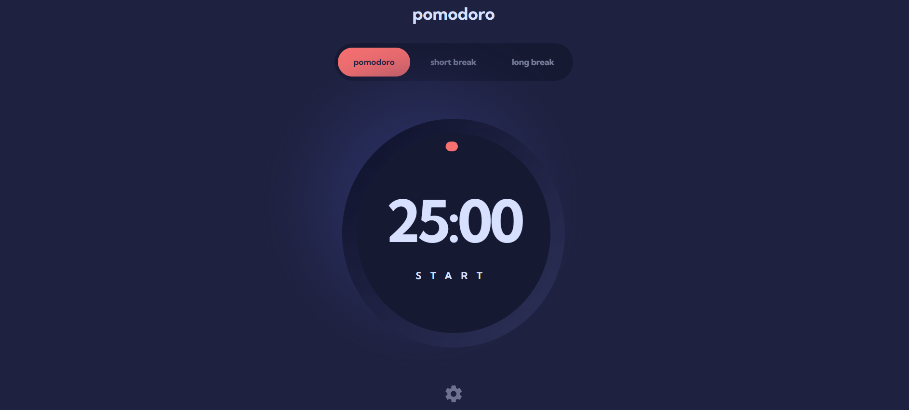

# Frontend Mentor - Pomodoro app solution

This is my solution to the [Pomodoro app challenge on Frontend Mentor](https://www.frontendmentor.io/challenges/pomodoro-app-KBFnycJ6G). Frontend Mentor challenges help you improve your coding skills by building realistic projects.

## Table of contents

- [Overview](#overview)
- [The challenge](#the-challenge)
- [Screenshot](#screenshot)
- [Links](#links)
- [Built with](#built-with)
- [Continued development](#continued-development)

## Overview

### The challenge

Users should be able to:

- Set a pomodoro timer and short & long break timers
- Customize how long each timer runs for
- See a circular progress bar that updates every minute and represents how far through their timer they are
- Customize the appearance of the app with the ability to set preferences for colors and fonts

### Screenshot

### Links

- Solution URL: [Add solution URL here](https://your-solution-url.com)
- Live Site URL: [Add live site URL here](https://your-live-site-url.com)

### Built with

- Semantic HTML5 markup
- CSS custom properties
- Flexbox
- Vuejs
- Pinia
- TypeScript
- Mobile-first workflow

### Continued development

In this section, I want to highlight areas that I plan to focus on in future projects. These include concepts that I am still mastering and techniques that I found particularly useful and wish to refine further.

1. **Advanced State Management**: While I have a good grasp of state management using Pinia, I want to delve deeper into more advanced patterns and best practices.
2. **Performance Optimization**: I aim to learn more about optimizing the performance of Vue.js applications, especially for larger projects.
3. **Testing**: I plan to improve my skills in writing unit and integration tests to ensure the reliability and maintainability of my code.
4. **Accessibility**: Ensuring that my applications are accessible to all users is a priority, and I want to continue learning about best practices in web accessibility.
5. **Responsive Design**: While I have implemented a mobile-first workflow, I want to further refine my skills in creating fully responsive and adaptive designs.

## Author

- Website - [Add your name here](https://www.your-site.com)
- Frontend Mentor - [@LucasDaSilva96](https://www.frontendmentor.io/profile/LucasDaSilva96)
- LinkedIn - [Lucas Da Silva](www.linkedin.com/in/lucas-da-silva-9955911a0)
