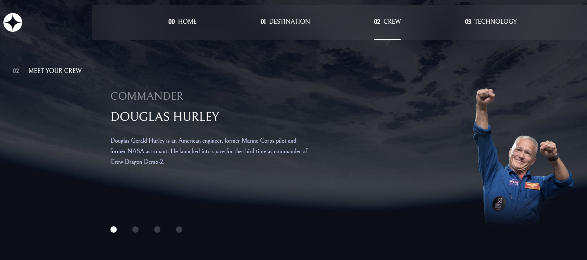

# Space Tourism Website



## Project Overview

This project is my solution to the **Space Tourism Website** challenge from [Frontend Mentor](https://www.frontendmentor.io/challenges/space-tourism-multipage-website-gRWj1URZ3). The website is built with modern front-end technologies, including **Vue 3**, **Tailwind CSS**, **GSAP**, and **TypeScript**, to create a dynamic and responsive multi-page site.

**Live Demo:** [Link to live site](https://space-tourism-x.netlify.app)

## Table of Contents

- [Features](#features)
- [Technologies Used](#technologies-used)
- [Project Setup](#project-setup)
- [Lessons Learned](#lessons-learned)
- [Future Improvements](#future-improvements)
- [Deployment](#deployment)
- [Connect](#connect)

## Features

- **Responsive Design**: Mobile-first approach with layouts optimized for different screen sizes.
- **Dynamic Tabs**: Toggle between tabs to see new content (e.g., crew, destinations, technology).
- **Smooth Animations**: Enhanced user experience using GSAP for animations and transitions.
- **Type Safety**: Full implementation of TypeScript to catch errors early and improve code quality.

## Technologies Used

- **Vue 3**: Reactive, component-based UI development.
- **Tailwind CSS**: Utility-first CSS framework for responsive design.
- **GSAP**: GreenSock Animation Platform for smooth animations and transitions.
- **TypeScript**: Strongly typed superset of JavaScript for improved developer experience and code maintainability.
- **Vite**: Fast development environment for building modern web apps.

## Project Setup

### Requirements

- **Node.js**: Make sure you have [Node.js](https://nodejs.org/en/) installed.
- **Package Manager**: Either `npm` or `yarn` can be used for dependency management.

### Installation

1. Clone the repository:

   ```bash
   git clone https://github.com/LucasDaSilva96/FrontEnd-Mentor---Projects.git
   ```

2. Navigate to the project directory:

   ```bash
   cd Space-tourism-multi-page-website
   ```

3. Install dependencies:

   ```bash
   npm install
   # or
   yarn install
   ```

4. Start the development server:

   ```bash
   npm run dev
   # or
   yarn dev
   ```

5. Open your browser at `http://localhost:3000` to view the project.

### Build for Production

To generate a production-ready build, use the following command:

```bash
npm run build
# or
yarn build
```

### Preview the Production Build

To preview the production build locally:

```bash
npm run preview
# or
yarn preview
```

## Lessons Learned

Throughout this project, I gained valuable experience with:

- **Vue 3 Composition API**: Leveraging the power of Vue’s composition API to structure code in a more flexible and scalable way.
- **Tailwind CSS**: Using utility-first classes to build a fully responsive layout without writing custom CSS.
- **GSAP Animations**: Implementing complex animations to create smooth, visually appealing transitions and effects.
- **TypeScript Integration**: Improving development experience by using TypeScript to catch potential errors early and ensure type safety.

I also improved my workflow with **Vite**, which significantly speeds up development with its fast Hot Module Replacement (HMR) and build times.

## Future Improvements

If I were to extend this project, I would consider the following:

- **Dark Mode**: Adding a theme toggle feature for light and dark modes.
- **Accessibility Enhancements**: Improve ARIA roles and semantic elements for better accessibility.
- **Unit Testing**: Implement unit tests with **Vue Test Utils** and **Jest** to ensure code reliability.
- **Server-side Rendering (SSR)**: Optimize for SEO by integrating **Nuxt.js** or SSR with Vue 3.
- **Performance Optimization**: Further optimize the performance by lazy loading components and images.

## Deployment

This project is deployed using **Netlify** for fast and scalable hosting. You can check the live version of the project here:

**Live Demo:** [Link to live site](https://space-tourism-x.netlify.app)

To deploy your own copy, simply follow these steps:

1. Connect the project repository to Netlify.
2. Configure your deployment settings (use the build command `npm run build` or `yarn build` and output directory `dist`).
3. Deploy the project.

## Connect

Feel free to reach out or connect with me:

- **Portfolio**: [portfolio](https://next-portfolio-three-mu.vercel.app/)
- **LinkedIn**: [linkedIn](www.linkedin.com/in/lucas-da-silva-9955911a0)
